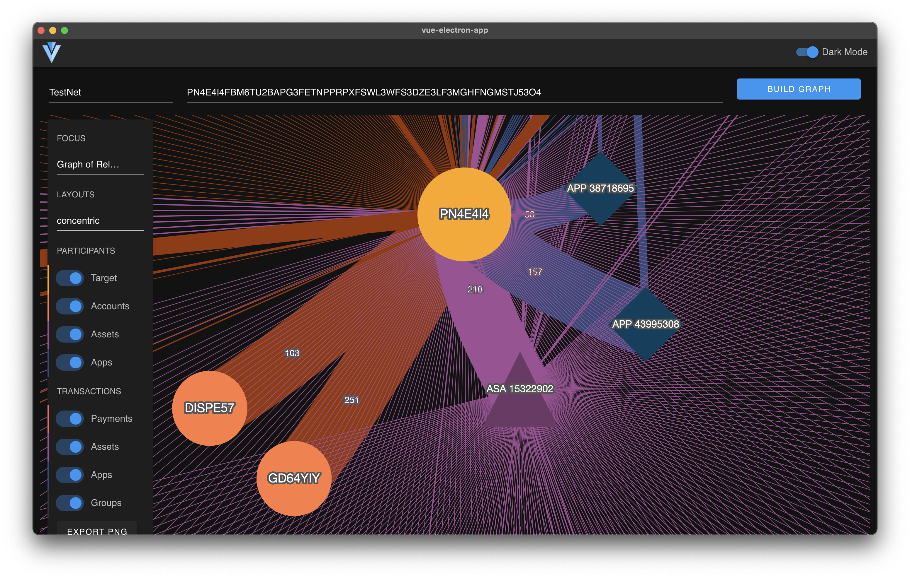

# Algorand Ballet

Algorand Ballet is a qualitative analysis tool for the Algorand blockchain. 

> UNDER THE SEEMING DISORDER OF THE OLD CITY, wherever the old city is working successfully, is a marvelous order for maintaining the safety of the streets and the freedom of the city. It is a complex order. Its essence is intricacy of sidewalk use, bringing with it a constant succession of eyes.
> 
> This order is all composed of movement and change, and although it is life, not art, we may fancifully call it the art form of the city and liken it to the dance – not to a simple-minded precision dance with everyone kicking up at the same time, twirling in unison and bowing off en masse, but to an intricate ballet in which the individual dancers and ensembles all have distinctive parts which miraculously reinforce each other and compose an orderly whole.
> 
> The ballet of the good city sidewalk never repeats itself from place to place, and in any one place is always replete with new improvisations.

– Excerpt from "The Death and Life of Great American Cities" (Random House), pages 40-43, by writer, activist, and pioneer of New Urbanism, Jane Jacobs (1916–2006)